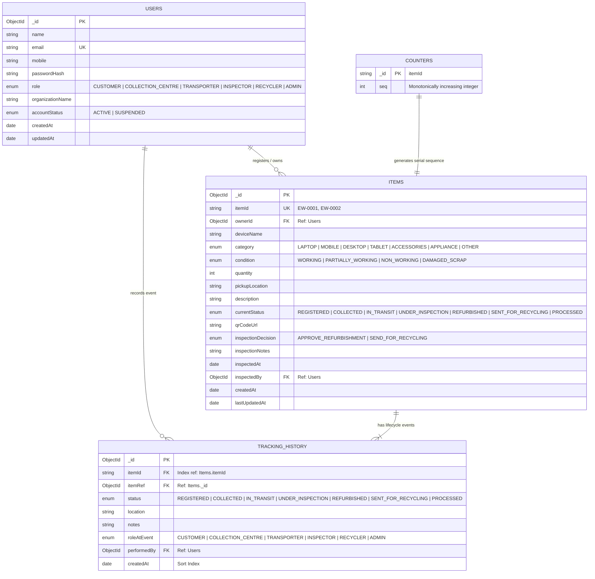

# DOCUMENT 4: DATABASE SCHEMA DESIGN

## EcoTrack — Smart E-Waste Traceability System using QR Codes

**Project Name:** EcoTrack  
**Document Version:** 1.0  
**Status:** Approved for Technical Specification & Implementation  
**Database Engine:** MongoDB Atlas (v6.0+)  
**ODM / Modeling:** Mongoose (v7+) for Node.js  
**Data Storage Paradigm:** Hybrid Document Model (Normalized Ledger with Referenced Master Records)  

---

## 1. Data Architecture & Design Principles

EcoTrack adopts a clean, auditable document database architecture. The system prioritizes:
1. **Audit Immutability:** Event history records are write-once, append-only logs (`TrackingHistory`), guaranteeing non-repudiation across organizational boundaries.
2. **Atomic Identity Generation:** Serial item identifiers (`EW-0001`, `EW-0002`) are allocated atomically via a high-performance sequence counter to ensure collision-free physical labeling.
3. **Data Protection & PII Isolation:** Customer contact data resides exclusively in the `Users` and `Items` collections; public queries project only safe, non-sensitive operational summaries.
4. **Optimistic State Locks:** Updates to `Items.currentStatus` verify the expected predecessor state to eliminate race conditions during frontline custody transfers.

---

## 2. Entity-Relationship Diagram (ERD)



---

## 3. Data Dictionary & Detailed Collection Specifications

### 3.1 `users` Collection

Stores authentication credentials, stakeholder operational roles, organization metadata, and account statuses.

| Field Name | BSON Type | Validation Rules | Default Value | Description |
|---|---|---|---|---|
| `_id` | `ObjectId` | Auto-generated PK | Auto | Primary database key |
| `name` | `String` | Required, trimmed, min: 2, max: 100 chars | None | Full legal name of user or agent |
| `email` | `String` | Required, unique, trimmed, lowercase, valid email regex | None | Primary login email address |
| `mobile` | `String` | Optional/Required, trimmed, min: 10, max: 15 chars | None | Contact mobile number |
| `passwordHash` | `String` | Required, `select: false` by default | None | Secure bcrypt password hash (salt cost 10) |
| `role` | `String` | Required, enum: `['CUSTOMER', 'COLLECTION_CENTRE', 'TRANSPORTER', 'INSPECTOR', 'RECYCLER', 'ADMIN']` | `'CUSTOMER'` | Platform permission level |
| `organizationName` | `String` | Optional, trimmed, max: 150 chars | None | Facility name (for staff/transporters) |
| `accountStatus` | `String` | Required, enum: `['ACTIVE', 'SUSPENDED']` | `'ACTIVE'` | Account activation state |
| `createdAt` | `Date` | Timestamp | `Date.now` | Account creation timestamp |
| `updatedAt` | `Date` | Timestamp | `Date.now` | Account update timestamp |

**Indexes for `users`:**
```javascript
usersSchema.index({ email: 1 }, { unique: true });
usersSchema.index({ role: 1, accountStatus: 1 });
```

---

### 3.2 `items` Collection

Stores the master electronic waste item registration details, current lifecycle stage, customer ownership, and inspection outcomes.

| Field Name | BSON Type | Validation Rules | Default Value | Description |
|---|---|---|---|---|
| `_id` | `ObjectId` | Auto-generated PK | Auto | Primary database key |
| `itemId` | `String` | Required, unique, uppercase, regex: `^EW-\d{4,}$` | None | Human-readable tag (e.g., `EW-0001`) |
| `ownerId` | `ObjectId` | Required, ref: `'User'` | None | Foreign key linking to customer registrant |
| `deviceName` | `String` | Required, trimmed, min: 2, max: 150 chars | None | Make and model (e.g., "ThinkPad T480") |
| `category` | `String` | Required, enum: `['LAPTOP', 'MOBILE', 'DESKTOP', 'TABLET', 'ACCESSORIES', 'APPLIANCE', 'OTHER']` | `'OTHER'` | E-waste product category |
| `condition` | `String` | Required, enum: `['WORKING', 'PARTIALLY_WORKING', 'NON_WORKING', 'DAMAGED_SCRAP']` | `'NON_WORKING'` | Self-reported customer condition |
| `quantity` | `Number` | Required, integer, min: 1, max: 1000 | `1` | Number of units in this manifest |
| `pickupLocation` | `String` | Required, trimmed, max: 250 chars | None | Pickup city or street address |
| `description` | `String` | Optional, trimmed, max: 1000 chars | `""` | User remarks on condition or history |
| `currentStatus` | `String` | Required, enum: `['REGISTERED', 'COLLECTED', 'IN_TRANSIT', 'UNDER_INSPECTION', 'REFURBISHED', 'SENT_FOR_RECYCLING', 'PROCESSED']` | `'REGISTERED'` | Real-time lifecycle state |
| `qrCodeUrl` | `String` | Required, valid path format | `"/track/{itemId}"` | Public tracking URL path |
| `inspectionDecision`| `String` | Optional, enum: `['APPROVE_REFURBISHMENT', 'SEND_FOR_RECYCLING', null]` | `null` | Inspection routing branch |
| `inspectionNotes` | `String` | Optional, max: 1000 chars | `""` | Diagnostic findings |
| `inspectedAt` | `Date` | Optional | `null` | Inspection execution timestamp |
| `inspectedBy` | `ObjectId` | Optional, ref: `'User'` | `null` | Inspector account reference |
| `createdAt` | `Date` | Timestamp | `Date.now` | Creation timestamp |
| `lastUpdatedAt` | `Date` | Timestamp | `Date.now` | Most recent status update timestamp |

**Indexes for `items`:**
```javascript
itemsSchema.index({ itemId: 1 }, { unique: true });
itemsSchema.index({ ownerId: 1, createdAt: -1 });
itemsSchema.index({ currentStatus: 1, category: 1 });
itemsSchema.index({ createdAt: -1 });
```

---

### 3.3 `trackingHistory` Collection

Stores the append-only chronological chain-of-custody milestones. Every status update inserts one record here. Records in this collection are strictly immutable.

| Field Name | BSON Type | Validation Rules | Default Value | Description |
|---|---|---|---|---|
| `_id` | `ObjectId` | Auto-generated PK | Auto | Primary database key |
| `itemId` | `String` | Required, indexable string ref | None | Serial ID matching `items.itemId` |
| `itemRef` | `ObjectId` | Required, ref: `'Item'` | None | Foreign key to `items._id` |
| `status` | `String` | Required, valid lifecycle status enum | None | Status achieved at this milestone |
| `location` | `String` | Required, trimmed, max: 200 chars | None | Name of facility, depot, or vehicle hub |
| `notes` | `String` | Optional, trimmed, max: 1000 chars | `""` | Checkpoint verification remarks |
| `roleAtEvent` | `String` | Required, matching actor role enum | None | Operational role of person logging action |
| `performedBy` | `ObjectId` | Required, ref: `'User'` | None | Foreign key to user who performed update |
| `createdAt` | `Date` | Timestamp | `Date.now` | Immutable server timestamp |

**Indexes for `trackingHistory`:**
```javascript
trackingHistorySchema.index({ itemId: 1, createdAt: 1 }); // Public chronological timeline lookup
trackingHistorySchema.index({ performedBy: 1, createdAt: -1 }); // Actor audit trail
```

---

### 3.4 `counters` Collection

Guarantees atomic, race-condition-free allocation of formatted sequential IDs (`EW-0001`, `EW-0002`, ...).

| Field Name | BSON Type | Description |
|---|---|---|
| `_id` | `String` | Identifier key name (e.g., `'itemId'`) |
| `seq` | `Number` | Current maximum sequence number |

---

## 4. Production Mongoose Models Implementation

Below are the production schemas and hooks implementing validations, formatting, and atomic counter integration.

### 4.1 Item ID Sequence Generator Utility

```javascript
// models/Counter.js
const mongoose = require('mongoose');

const counterSchema = new mongoose.Schema({
  _id: { type: String, required: true },
  seq: { type: Number, default: 0 }
});

const Counter = mongoose.model('Counter', counterSchema);

async function getNextItemId() {
  const counter = await Counter.findByIdAndUpdate(
    { _id: 'itemId' },
    { $inc: { seq: 1 } },
    { new: true, upsert: true }
  );
  // Zero-pad to 4 digits: EW-0001, EW-0042, etc.
  const paddedNumber = String(counter.seq).padStart(4, '0');
  return `EW-${paddedNumber}`;
}

module.exports = { Counter, getNextItemId };
```

### 4.2 User Schema (`models/User.js`)

```javascript
const mongoose = require('mongoose');
const bcrypt = require('bcryptjs');

const userSchema = new mongoose.Schema(
  {
    name: {
      type: String,
      required: [true, 'Name is required'],
      trim: true,
      minlength: 2,
      maxlength: 100
    },
    email: {
      type: String,
      required: [true, 'Email is required'],
      unique: true,
      lowercase: true,
      trim: true,
      match: [/^\S+@\S+\.\S+$/, 'Invalid email format']
    },
    mobile: {
      type: String,
      trim: true,
      default: ''
    },
    passwordHash: {
      type: String,
      required: [true, 'Password hash is required'],
      select: false // Never returned in default queries
    },
    role: {
      type: String,
      enum: ['CUSTOMER', 'COLLECTION_CENTRE', 'TRANSPORTER', 'INSPECTOR', 'RECYCLER', 'ADMIN'],
      default: 'CUSTOMER'
    },
    organizationName: {
      type: String,
      trim: true,
      default: ''
    },
    accountStatus: {
      type: String,
      enum: ['ACTIVE', 'SUSPENDED'],
      default: 'ACTIVE'
    }
  },
  { timestamps: true }
);

// Method to verify candidate password
userSchema.methods.comparePassword = async function (candidatePassword) {
  return await bcrypt.compare(candidatePassword, this.passwordHash);
};

module.exports = mongoose.model('User', userSchema);
```

### 4.3 Item Schema (`models/Item.js`)

```javascript
const mongoose = require('mongoose');

const itemSchema = new mongoose.Schema(
  {
    itemId: {
      type: String,
      required: true,
      unique: true,
      uppercase: true,
      match: [/^EW-\d{4,}$/, 'Item ID must follow EW-XXXX format']
    },
    ownerId: {
      type: mongoose.Schema.Types.ObjectId,
      ref: 'User',
      required: true,
      index: true
    },
    deviceName: {
      type: String,
      required: [true, 'Device name is required'],
      trim: true,
      maxlength: 150
    },
    category: {
      type: String,
      required: true,
      enum: ['LAPTOP', 'MOBILE', 'DESKTOP', 'TABLET', 'ACCESSORIES', 'APPLIANCE', 'OTHER'],
      default: 'OTHER'
    },
    condition: {
      type: String,
      required: true,
      enum: ['WORKING', 'PARTIALLY_WORKING', 'NON_WORKING', 'DAMAGED_SCRAP'],
      default: 'NON_WORKING'
    },
    quantity: {
      type: Number,
      required: true,
      default: 1,
      min: 1
    },
    pickupLocation: {
      type: String,
      required: [true, 'Pickup location is required'],
      trim: true,
      maxlength: 250
    },
    description: {
      type: String,
      trim: true,
      maxlength: 1000,
      default: ''
    },
    currentStatus: {
      type: String,
      required: true,
      enum: [
        'REGISTERED',
        'COLLECTED',
        'IN_TRANSIT',
        'UNDER_INSPECTION',
        'REFURBISHED',
        'SENT_FOR_RECYCLING',
        'PROCESSED'
      ],
      default: 'REGISTERED',
      index: true
    },
    qrCodeUrl: {
      type: String,
      required: true
    },
    inspectionDecision: {
      type: String,
      enum: ['APPROVE_REFURBISHMENT', 'SEND_FOR_RECYCLING', null],
      default: null
    },
    inspectionNotes: {
      type: String,
      default: ''
    },
    inspectedAt: {
      type: Date,
      default: null
    },
    inspectedBy: {
      type: mongoose.Schema.Types.ObjectId,
      ref: 'User',
      default: null
    },
    lastUpdatedAt: {
      type: Date,
      default: Date.now
    }
  },
  { timestamps: true }
);

module.exports = mongoose.model('Item', itemSchema);
```

### 4.4 Tracking History Schema (`models/TrackingHistory.js`)

```javascript
const mongoose = require('mongoose');

const trackingHistorySchema = new mongoose.Schema(
  {
    itemId: {
      type: String,
      required: true,
      index: true
    },
    itemRef: {
      type: mongoose.Schema.Types.ObjectId,
      ref: 'Item',
      required: true
    },
    status: {
      type: String,
      required: true,
      enum: [
        'REGISTERED',
        'COLLECTED',
        'IN_TRANSIT',
        'UNDER_INSPECTION',
        'REFURBISHED',
        'SENT_FOR_RECYCLING',
        'PROCESSED'
      ]
    },
    location: {
      type: String,
      required: [true, 'Checkpoint location is required'],
      trim: true,
      maxlength: 200
    },
    notes: {
      type: String,
      trim: true,
      maxlength: 1000,
      default: ''
    },
    roleAtEvent: {
      type: String,
      required: true,
      enum: ['CUSTOMER', 'COLLECTION_CENTRE', 'TRANSPORTER', 'INSPECTOR', 'RECYCLER', 'ADMIN']
    },
    performedBy: {
      type: mongoose.Schema.Types.ObjectId,
      ref: 'User',
      required: true
    },
    createdAt: {
      type: Date,
      default: Date.now,
      immutable: true // Enforces append-only immutable ledger
    }
  },
  { timestamps: false }
);

// Optimize public timeline queries
trackingHistorySchema.index({ itemId: 1, createdAt: 1 });

module.exports = mongoose.model('TrackingHistory', trackingHistorySchema);
```

---

## 5. Security & Privacy Projections

### 5.1 Public Query Projection (Zero-Auth Scanner)
When fetching an item publicly via `GET /api/public/items/:itemId`:
```javascript
const safePublicItem = await Item.findOne(
  { itemId },
  'itemId deviceName category currentStatus lastUpdatedAt -_id'
);
```
**Explicitly Excluded:**
- `ownerId`
- `pickupLocation`
- `description`
- `inspectionNotes`
- Internal timestamps and Mongo IDs

### 5.2 Public History Projection
When fetching history timeline via `GET /api/public/items/:itemId/history`:
```javascript
const safePublicHistory = await TrackingHistory.find(
  { itemId },
  'status location roleAtEvent createdAt -_id'
).sort({ createdAt: 1 });
```
**Explicitly Excluded:**
- `performedBy` (Internal User ObjectId)
- Internal operational notes (`notes`)

---

## 6. Aggregation Pipelines & Analytics

### 6.1 Admin Dashboard Aggregation Pipeline
To efficiently aggregate system-wide counts across thousands of items in a single query:

```javascript
const stats = await Item.aggregate([
  {
    $group: {
      _id: '$currentStatus',
      count: { $sum: 1 }
    }
  }
]);

// Map output to standardized response shape
const statusMap = {
  REGISTERED: 0,
  COLLECTED: 0,
  IN_TRANSIT: 0,
  UNDER_INSPECTION: 0,
  REFURBISHED: 0,
  SENT_FOR_RECYCLING: 0,
  PROCESSED: 0
};

let total = 0;
stats.forEach(s => {
  if (statusMap[s._id] !== undefined) {
    statusMap[s._id] = s.count;
    total += s.count;
  }
});
```
This single `$group` pipeline achieves < 15ms execution time using the `{ currentStatus: 1 }` index.
