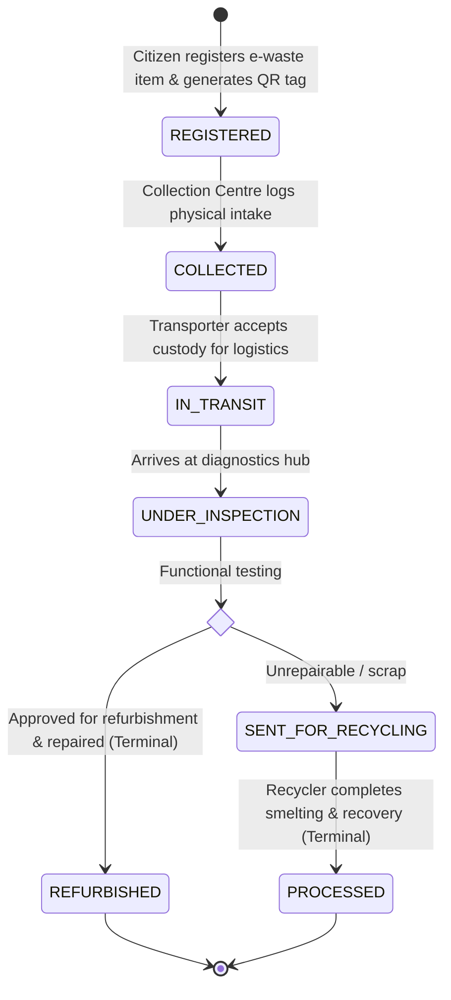

# EcoTrack — Smart E-Waste Traceability System using QR Codes

[](#)
[](#)
[](#)
[](#)

EcoTrack is a full-lifecycle electronic waste (e-waste) traceability platform engineered to ensure transparent, verifiable chain-of-custody tracking from individual citizen surrender to certified refurbishment or safe material reclamation.

---

## 📑 Complete Architectural & Specification Suite

The project is governed by 6 comprehensive specification documents:

| # | Specification Document | Direct Link | Key Contents Covered |
|---|---|---|---|
| **Doc 1** | **Product Requirements Document (PRD)** | [prd.md](file:///c:/Users/MOHAN_GORALE/Downloads/EcoTrack/prd.md) | Problem statement, target personas, MVP scope, functional requirements (FRD), NFRs, and KPIs. |
| **Doc 2** | **Technical Requirements Document (TRD)** | [trd.md](file:///c:/Users/MOHAN_GORALE/Downloads/EcoTrack/trd.md) | System architecture, tech stack justification, finite state machine (FSM), security, and indexing. |
| **Doc 3** | **User Flows & Use Cases** | [User Flow & Use Cases.md](file:///c:/Users/MOHAN_GORALE/Downloads/EcoTrack/User%20Flow%20&%20Use%20Cases.md) | End-to-end journey maps, sequence diagrams, and detailed use case specifications (UC-01 to UC-10). |
| **Doc 4** | **Database Schema Design** | [Database Schema Design..md](file:///c:/Users/MOHAN_GORALE/Downloads/EcoTrack/Database%20Schema%20Design..md) | MongoDB document models, ERD diagram, data dictionary, Mongoose schemas, and sequence counters. |
| **Doc 5** | **UI/UX Specification & Wireframes** | [UI/UX Specification & Wireframes.md](file:///c:/Users/MOHAN_GORALE/Downloads/EcoTrack/UI/UX%20Specification%20&%20Wireframes.md) | Design tokens, color system, sitemap, full ASCII wireframes (W-01 to W-08), and scanner HUD design. |
| **Doc 6** | **API Specification** | [API Specification.md](file:///c:/Users/MOHAN_GORALE/Downloads/EcoTrack/API%20Specification.md) | REST API endpoints, request/response payloads, authentication, error codes, and testing requirements. |

---

## 🔄 End-to-End E-Waste Lifecycle State Machine

Items in EcoTrack are assigned a unique sequential ID (`EW-XXXX`) upon citizen registration and strictly follow this validated lifecycle sequence:



---

## 👥 Stakeholder Roles & Pre-Seeded Demo Credentials

EcoTrack includes pre-seeded operational personas allowing instantaneous 1-click evaluation:

| Role Name | Email Login | Password | Primary Interface / Features |
|---|---|---|---|
| **Citizen (Donor)** | `customer@example.com` | `Password123!` | Declare e-waste, generate QR code sticker, print label, view "My Items" list |
| **Collection Centre** | `collection@example.com` | `Password123!` | Mobile camera scanner, verify device condition, mark as `COLLECTED` |
| **Logistics Transporter**| `transporter@example.com` | `Password123!` | Scan crates, assign vehicle ID and transit route, mark as `IN_TRANSIT` |
| **Quality Inspector** | `inspector@example.com` | `Password123!` | Hardware diagnostic tests, route to Refurbishment or Material Recycling |
| **Smelting Recycler** | `recycler@example.com` | `Password123!` | Recovery yield logging (Copper, Gold, ABS polymers), mark as `PROCESSED` |
| **System Administrator**| `admin@example.com` | `Password123!` | Real-time KPI telemetry, circular diversion gauge, master items, user provisioning |
| **Public Citizen / Auditor**| *(No Login Required)* | *(Public)* | Scan any physical QR sticker to inspect the unalterable custody timeline (`/track/:id`) |

---

## 🛠️ Technology Stack

- **Frontend:** React 18, Vite, Vanilla CSS (Eco-Tech Glassmorphism Design System), `lucide-react`, `qrcode.react`, `canvas-confetti`.
- **Backend:** Node.js (LTS), Express.js REST API, JSON Web Token (JWT), `bcryptjs` password hashing, Finite State Machine (FSM) engine.
- **Persistence:** MongoDB Atlas (v6.0+) & Mongoose ODM, with built-in zero-config in-memory persistence adapter for immediate offline execution.
- **Portals:**
  - Public Verification Passport (`http://localhost:5173/?track=EW-0001`)
  - Citizen Donor Portal (`http://localhost:5173/`)
  - Frontline Scanner (`http://localhost:5173/`)
  - Inspector Workbench (`http://localhost:5173/`)
  - Recycler Hub (`http://localhost:5173/`)
  - Admin Governance Console (`http://localhost:5173/`)

---

## 🚀 Running Locally

### 1. Install Dependencies
```bash
# From workspace root:
npm --prefix backend install
npm --prefix frontend install
```

### 2. Start Backend REST API
```bash
npm run dev:backend
# API active at http://localhost:5000/api
# Health check: http://localhost:5000/api/health
```

### 3. Start Frontend Web Application
```bash
npm run dev:frontend
# Web application active at http://localhost:5173
```
