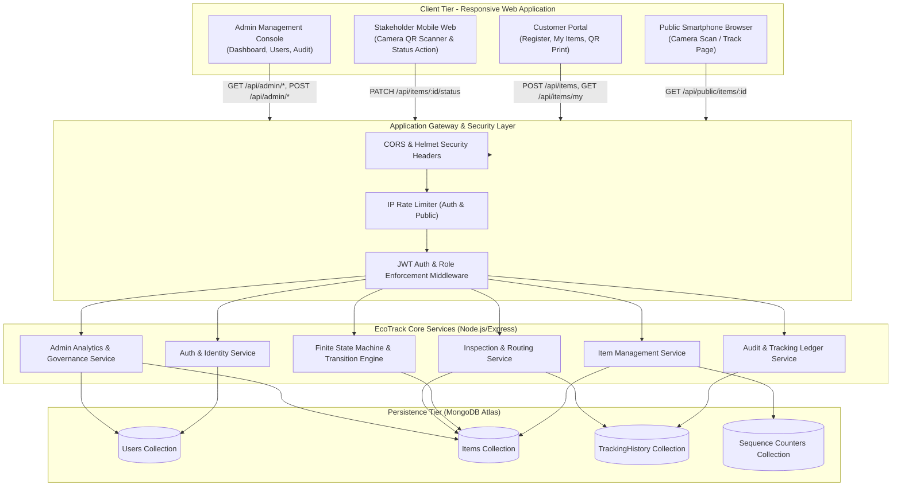
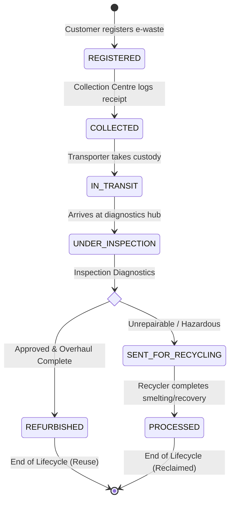

# DOCUMENT 2: TECHNICAL REQUIREMENTS DOCUMENT (TRD)

## EcoTrack — Smart E-Waste Traceability System using QR Codes

**Project Name:** EcoTrack  
**Document Version:** 1.0  
**Status:** Approved for Technical Specification & Implementation  
**Backend Runtime:** Node.js (LTS v18+) & Express.js  
**Database:** MongoDB Atlas (v6.0+) & Mongoose ODM  
**Frontend Framework:** React 18+ (Vite) with Vanilla CSS Design System  
**Authentication:** JWT Bearer Access Tokens with bcrypt Hashing  

---

## 1. System Architecture Overview

EcoTrack follows a decoupled client-server architecture centered around a RESTful API service, an event-driven audit ledger, and a responsive web application that accommodates both authenticated desktop/mobile workflows and zero-auth public mobile QR lookups.

### 1.1 High-Level Architecture Diagram



---

## 2. Technology Stack & Technical Justifications

| Tier / Component | Technology Selected | Rationale & Justification |
|---|---|---|
| **Frontend Framework** | **React 18 (Vite)** | Blazing fast build tooling (ESM), component reusability, seamless state handling for forms and camera scanners. |
| **Frontend Styling** | **Vanilla CSS + Custom Design System** | Clean, lightweight CSS variables, glassmorphic styling, zero third-party CSS dependencies, instant loading without heavy frameworks. |
| **QR Generation** | **`qrcode` (or `qrcode.react`)** | Generates SVG/Canvas high-density 2D barcodes client-side without relying on external network generation APIs. |
| **QR Scanner** | **`html5-qrcode` / Web Camera API** | Cross-platform camera access via standard browser `navigator.mediaDevices` with hardware-accelerated QR code decoding. |
| **Backend Framework** | **Node.js (v18+) with Express.js** | Asynchronous non-blocking I/O ideal for rapid API lookups, JSON-native handling, ubiquitous JavaScript across stack. |
| **Database Engine** | **MongoDB Atlas (v6.0+)** | Document model fits polymorphic e-waste categories, flexible audit event documents, native JSON compatibility, high read throughput. |
| **ODM / Modeling** | **Mongoose (v7+)** | Robust schema definition, type casting, lifecycle hooks, validation constraints, and population capabilities. |
| **Authentication** | **JSON Web Token (JWT) + bcryptjs** | Stateless authentication, claims-embedded authorization tokens, industry standard bcrypt password hashing (cost factor 10). |
| **Security Middleware** | **Helmet, CORS, express-rate-limit** | Protection against HTTP header vulnerabilities, strict origin whitelisting, brute-force mitigation on auth routes. |

---

## 3. Finite State Machine (FSM) Specification

Traceability integrity requires that no item can bypass required physical custodians. The FSM strictly validates every proposed status update before committing it to storage.

### 3.1 State Diagram



### 3.2 State Transition Matrix & Role Authorization Table

| Current State (`currentStatus`) | Permitted Target State | Authorized Actor Roles | Transition Trigger Endpoint | Required Event Metadata |
|---|---|---|---|---|
| *(None / New)* | `REGISTERED` | `CUSTOMER` | `POST /api/items` | Device Name, Category, Condition, Quantity, Pickup Address |
| `REGISTERED` | `COLLECTED` | `COLLECTION_CENTRE`, `ADMIN` | `PATCH /api/items/:id/status` | Facility Location Name, Receipt Verification Notes |
| `COLLECTED` | `IN_TRANSIT` | `TRANSPORTER`, `ADMIN` | `PATCH /api/items/:id/status` | Transit Hub / Vehicle ID, Departure Notes |
| `IN_TRANSIT` | `UNDER_INSPECTION` | `INSPECTOR`, `ADMIN` | `PATCH /api/items/:id/status` | Diagnostics Hub Location, Intake Checklist Notes |
| `UNDER_INSPECTION` | `SENT_FOR_RECYCLING` | `INSPECTOR`, `ADMIN` | `POST /api/items/:id/inspection` | Decision: `SEND_FOR_RECYCLING`, Defect Summary Notes |
| `UNDER_INSPECTION` | `REFURBISHED` | `INSPECTOR`, `ADMIN` | `PATCH /api/items/:id/status` | Refurbishment Testing Verification, Parts Replaced Notes |
| `SENT_FOR_RECYCLING` | `PROCESSED` | `RECYCLER`, `ADMIN` | `PATCH /api/items/:id/status` | Smelting Facility Name, Material Recovery Completion Notes |
| `REFURBISHED` | *(Terminal)* | *None* | *Rejected (400 Bad Request)* | Item reached final certified reuse milestone. |
| `PROCESSED` | *(Terminal)* | *None* | *Rejected (400 Bad Request)* | Item reached final certified material extraction milestone. |

---

## 4. Item ID & QR Code Architecture

### 4.1 Unique Identifier Generation Scheme
Items are issued a clean, human-readable serial ID:
- **Format:** `EW-XXXX` (where `XXXX` is a zero-padded incremental sequence starting at `0001`, e.g., `EW-0001`, `EW-0042`, `EW-1250`).
- **Atomicity:** Generated via an atomic MongoDB sequence counter (`$inc: { seq: 1 }` in a dedicated `counters` collection) to guarantee absolute uniqueness under concurrent registration requests.

### 4.2 QR Code Payload Standard
- **Payload Schema:** Uniform Resource Locator (URL).
- **Target URL:** `https://<application-domain>/track/<itemId>`
- **Example:** `https://ecotrack.example.com/track/EW-0001`
- **Error Correction Level:** **Level M (15% error recovery)** or **Level Q (25% error recovery)** to ensure scanner readability even if the printed sticker suffers minor scratches or dust during warehouse transit.
- **Physical Label Standard:** QR code matrix sized at minimum 30mm &times; 30mm, accompanied by bold human-readable text (`EW-0001`) immediately underneath for manual keyboard entry if the barcode is defaced.

---

## 5. Security & Privacy Architecture

### 5.1 Authentication Flow
1. Client submits credentials to `POST /api/auth/login`.
2. Server validates email/password against stored `bcrypt` hash (salt cost 10).
3. Upon success, server generates a JWT containing:
   ```json
   {
     "sub": "651a1b2c3d4e5f6789012345",
     "role": "COLLECTION_CENTRE",
     "email": "staff@example.com",
     "iat": 1728468000,
     "exp": 1728554400
   }
   ```
4. Client stores token securely in browser storage (`localStorage` / in-memory context) and transmits it via `Authorization: Bearer <token>` header on subsequent protected API requests.

### 5.2 Role-Based Access Control (RBAC) Middleware
The backend applies a layered middleware pattern:
```javascript
// 1. Authenticate Token
const verifyToken = (req, res, next) => { ... };

// 2. Authorize Required Roles
const requireRoles = (...allowedRoles) => {
  return (req, res, next) => {
    if (!allowedRoles.includes(req.user.role)) {
      return res.status(403).json({
        success: false,
        message: "Forbidden: Insufficient privileges",
        errorCode: "FORBIDDEN"
      });
    }
    next();
  };
};
```

### 5.3 Public Data Sanitization & Projection Strategy
To prevent Personally Identifiable Information (PII) leakage when third parties or consumers scan QR codes:
- **Redacted Fields on Public Endpoints (`/api/public/*`):**
  - Owner User ID, Customer Name, Mobile Number, Email Address
  - Detailed residential street address / pickup coordinates
  - Internal administrative logs and internal user IDs
- **Exposed Public Fields:**
  - `itemId`, `deviceName`, `category`, `currentStatus`, `lastUpdatedAt`
  - Public tracking timeline list: `status`, `location` (facility/city level), `roleAtEvent`, `createdAt`

---

## 6. Data Integrity & Consistency Strategy

### 6.1 Status Update Synchronization
Every status update requires mutating the `items` collection (`currentStatus`, `lastUpdatedAt`) and appending a corresponding document to the `trackingHistory` collection.

```javascript
// Dual-write execution with error handling & rollback
async function executeStatusTransition(itemId, newStatus, location, notes, actor) {
  // 1. Fetch item & validate state transition rule
  const item = await Item.findOne({ itemId });
  if (!item) throw new NotFoundError("ITEM_NOT_FOUND");
  validateTransition(item.currentStatus, newStatus, actor.role);

  // 2. Perform atomic document update
  const updatedItem = await Item.findOneAndUpdate(
    { itemId, currentStatus: item.currentStatus }, // Optimistic concurrency lock
    { 
      $set: { 
        currentStatus: newStatus, 
        lastUpdatedAt: new Date() 
      } 
    },
    { new: true }
  );

  // 3. Create immutable history record
  const historyEvent = await TrackingHistory.create({
    itemId,
    status: newStatus,
    location,
    notes: notes || "",
    roleAtEvent: actor.role,
    performedBy: actor.id,
    createdAt: new Date()
  });

  return { updatedItem, historyEvent };
}
```

---

## 7. Performance & Caching Specifications

### 7.1 Database Indexing Strategy
To guarantee < 50ms database lookup times:
- `items`: `{ itemId: 1 }` (Unique, sparse)
- `items`: `{ ownerId: 1, createdAt: -1 }` (Compound index for customer items list)
- `items`: `{ currentStatus: 1, createdAt: -1 }` (Admin filtering and stats aggregation)
- `trackingHistory`: `{ itemId: 1, createdAt: 1 }` (Ordered chronological lookup for public tracker)
- `users`: `{ email: 1 }` (Unique index for fast authentication)

### 7.2 Rate Limiting Policies
- `Auth Endpoints (/api/auth/login, /register)`: 10 requests per 15-minute window per IP.
- `Public Tracking (/api/public/items/*)`: 120 requests per minute per IP to prevent scraper exhaustion.
- `Protected Core Endpoints (/api/items/*)`: 300 requests per 15-minute window per authenticated session.

---

## 8. Environment & Configuration Specifications

### 8.1 Backend Configuration (`backend/.env`)
```env
PORT=5000
NODE_ENV=development
MONGODB_URI=mongodb+srv://<user>:<password>@cluster0.mongodb.net/ecotrack?retryWrites=true&w=majority
JWT_SECRET=super_secret_jwt_high_entropy_key_change_in_production
JWT_EXPIRES_IN=24h
CLIENT_URL=http://localhost:5173
```

### 8.2 Frontend Configuration (`frontend/.env`)
```env
VITE_API_BASE_URL=http://localhost:5000/api
VITE_APP_NAME=EcoTrack
```

---

## 9. Verification & Acceptance Testing Criteria

1. **FSM Enforcement:** Attempting to transition from `REGISTERED` directly to `REFURBISHED` returns `400 Bad Request` with `INVALID_STATUS_TRANSITION`.
2. **Unauthorized Actor Block:** Attempting to call `PATCH /api/items/:id/status` as a `CUSTOMER` returns `403 Forbidden`.
3. **Public Redaction:** Calling `GET /api/public/items/:itemId` returns zero customer personal records.
4. **QR Generation & Scan:** Registering an item outputs a valid QR matrix that decodes exactly to the public tracking URL and renders the live timeline upon inspection.
